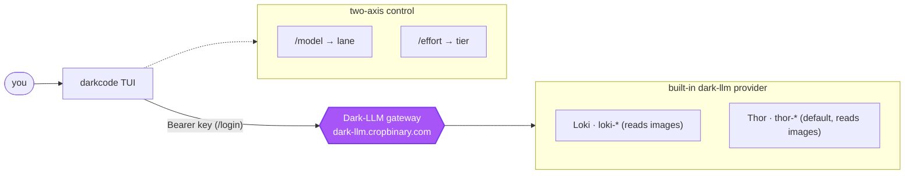

<p align="center">
  <h1 align="center">darkcode</h1>
</p>

<p align="center">A polished, <strong>power-purple</strong> terminal coding agent locked to your self-hosted <strong>Dark-LLM</strong> gateway.</p>

<p align="center">
  <a href="#install"></a>
  <a href="LICENSE"></a>
  <a href="https://github.com/chatthong/darkcode"></a>
</p>

---

**darkcode** is an MIT-licensed fork of [opencode](https://github.com/sst/opencode), rebranded around a vivid "power purple" accent and locked into being a dedicated terminal client for the self-hosted [Dark-LLM](https://dark-llm.cropbinary.com) gateway. It ships a built-in `dark-llm` provider - two chat lanes (Loki, Thor) across four effort tiers (low / med / high / ultra), each reading images directly via its own mmproj projector - and hides every other provider, so a fresh install talks to one gateway and nothing else.

Its config lives in its own `~/.config/darkcode` directory, so it never touches your opencode setup. The interface is a stripped-down, Claude Code-style TUI: a compact mascot header that scrolls with the chat, a clean divider-framed input, and a single live "working" indicator with a rotating, faintly sassy verb.

> **Early preview.** darkcode is under active development and diverges from upstream opencode. It is not affiliated with or endorsed by the opencode team. See [Relationship to opencode](#relationship-to-opencode).

## Highlights

- **One gateway, one provider.** Hard-locked to the built-in `dark-llm` provider. No opencode / openai / anthropic entries ever appear in the picker - `enabled_providers` is forced after all config merges.
- **Two-axis model control.** Pick the lane with `/model` (Loki / Thor) and the effort tier with `/effort` (low / med / high / ultra). The chat lanes compose into `<family>-<tier>`, e.g. `thor-med`. Both lanes read images directly through their own mmproj projector, so there is no separate vision lane.
- **Live model list.** The picker pulls `GET /v1/models` from the gateway with your signed-in key, so you see exactly what your key is entitled to, and falls back to a static built-in list when offline.
- **Browser sign-in.** `/login` opens the gateway `/token` page, which mints and shows a key to paste back; `/logout` removes it.
- **Context at a glance.** `/context` shows context-window usage with a segmented per-category bar, a token breakdown, and running cost.
- **Vivid purple look.** A single accent - `#a855f7` dark, `#7c3aed` light - defined in one place and working in both dark and light terminals.
- **Isolated config.** Everything lives under `~/.config/darkcode` (and sibling XDG dirs), never your opencode config or keys.

## Install

darkcode installs **from source only**. There is no npm package or prebuilt binary yet, so you clone the repo, install dependencies with [Bun](https://bun.sh), and run the committed `./darkcode` launcher. Bun is the only runtime you need; there is no build step.

```bash
git clone https://github.com/chatthong/darkcode.git
cd darkcode
bun install
./darkcode --help          # runs immediately, no build step
```

To run `darkcode` from any project directory, symlink the launcher onto your `PATH`. A symlink (rather than a copy) keeps it pointing at the repo, so `git pull` alone updates your installed command:

```bash
sudo ln -s "$(pwd)/darkcode" /usr/local/bin/darkcode

darkcode --help              # now works from anywhere
cd ~/my-project && darkcode  # operates on your current directory
```

No `/usr/local/bin`, or prefer no `sudo`? Link into any dir on your `PATH`, for example `~/.local/bin/darkcode`.

> **Why a launcher and not `bun run src/index.ts`?**
> darkcode's TUI uses SolidJS JSX, which Bun only transforms when the `@opentui/solid` preload is active. The `./darkcode` script wires that up while keeping *your* working directory as the project:
>
> ```bash
> exec bun --preload "$preload" packages/opencode/src/index.ts "$@"
> ```
>
> Running the entry file directly without the preload fails with `Cannot find module 'react/jsx-dev-runtime'`. Always start through the launcher.

Contributors: the repo installs a Husky **pre-push git hook** that checks your Bun version against the pinned `packageManager` and runs the full `bun turbo typecheck` before every push. It only affects pushing, not running.

See [docs/install.md](docs/install.md) for the full launcher walkthrough, PATH options, updating, and troubleshooting.

## Quick start

```bash
darkcode        # start the TUI (defaults to the dark-llm provider)
```

Then, inside the TUI:

```
/login          # sign in: opens the gateway /token page, paste the key back
/model          # pick a lane:  Loki (fast) · Thor (coding, default) - both read images
/effort         # pick a tier:  low · med · high · ultra
/context        # see context-window usage, token breakdown, and cost
```

The default model is `dark-llm/thor-med`. Non-interactive use works too:

```bash
darkcode run --model dark-llm/loki-low "explain this error"
```

## Models

The built-in `dark-llm` provider exposes **two chat lanes**. A chat model id is always `<family>-<tier>` (for example `thor-med`). Both lanes read images directly - each loads its own mmproj projector - so there is no separate vision lane.

| Lane | Family (`<family>`) | Backing model | Best for |
| --- | --- | --- | --- |
| **Loki** | `loki` | Qwen3.6-35B-A3B MoE | Fast lane - quick answers and cheap fan-out; reads images |
| **Thor** | `thor` | Qwen3.6-27B HauhauCS | Coding - the default lane; reads images |

Loki and Thor both carry the four effort tiers below. (Thor also has a ~1M-context variant, `thor-1m`, reached via the `thor-1m-<tier>` ids and selectable with `--model`; it reads images too.)

| Tier | Thinking | Context | Max output |
| --- | --- | --- | --- |
| `low` | off | 64k | 4,096 |
| `med` | on | 128k | 8,192 (default) |
| `high` | on | 200k | 16,384 |
| `ultra` | on | 256k | 32,768 |

`/model` switches only the lane (keeping your tier) and `/effort` switches only the tier (keeping your lane), so a typical flow is `/model` to Thor, then `/effort` to `ultra`, giving `thor-ultra`. Either lane can read an image directly - no lane switch needed. There is no `/models` command - `/model` is the single lane picker.



The list is **live**. With a signed-in key (or `DARK_LLM_KEY` set), darkcode calls `GET https://dark-llm.cropbinary.com/v1/models` and reconciles the result against the static built-in set (keeping known metadata, dropping ids the gateway does not return, synthesizing unknown ones, filtering out embedding models). Any failure - offline, no key, or a 4s timeout - falls back to the static list, so the picker is never empty.

See [docs/models.md](docs/models.md) for the full lane/tier reference and the live-refresh details.

## Signing in

`/login` is a **browser-only** flow:

1. It opens the gateway's `/token` page (`https://dark-llm.cropbinary.com/token`) in your default browser. The link is also printed in the dialog if the browser does not open.
2. You sign in **on that page itself** - it shows a username + password form, with no new tab and no gateway dashboard to land on. On success it mints and displays a darkcode key (`sk-...`); wrong credentials show an inline error so you can retry in place. A **Sign out** button on the page clears the session again, handy on shared machines.
3. Paste the key back into the waiting prompt. darkcode validates it against `GET /v1/models` and, if the gateway accepts it, stores it and shows *"Signed in to Dark LLM."*

`/logout` removes the stored `dark-llm` credential and returns you to a signed-out state.

For CI, containers, or any non-interactive environment, set the key through the `DARK_LLM_KEY` environment variable instead:

```bash
export DARK_LLM_KEY="sk-..."
darkcode
```

The key is stored in darkcode's isolated auth store (`auth.json`, mode `0600`, under `~/.local/share/darkcode/`). See [docs/auth.md](docs/auth.md).

## The interface

darkcode ships a Claude Code-style TUI, everything inside a single scrollbox:

```
▛▀▀▀▜  darkcode v0.x.x
▌▪ ▪▐  thor-med  dark-llm
▌ ▬ ▐  ~/code/project
▙▄▄▄▟

  › how do I ...            (your messages and the model's answers)

  ▓ You wish I was faster  (12s · ↓ 1.2k tokens)   <- one live working row

────────────────────────────────────────────────────────
  › <your next prompt>
────────────────────────────────────────────────────────
  Thor · thor-med  dark-llm        tab agents  ctrl+p commands
```

- **Scrolling mascot header** - a small pixel face (in the brand purple) with `darkcode`, the model, and the cwd. It lives *inside* the scrollbox, so it scrolls away with the conversation instead of being pinned.
- **Clean input** - full-width divider lines above and below frame a `›` prompt indicator. No shaded box, no placeholder text.
- **Footer** - the current agent/model/provider on the left when idle, `tab agents` / `ctrl+p commands` hints on the right, above a full-width divider.
- **One live working indicator** - a block spinner plus a rotating sassy verb (from `working-verb.tsx`, e.g. *"Ugh, fine..."*, *"The audacity..."*) plus `(elapsed · ↓ tokens)`, shown the instant the session goes busy. It is the single live signal - there is no footer spinner or per-message header.
- **Quiet reasoning** - while thinking, nothing extra shows; once done, a muted grey `Thought: Xs` summary renders *below* the answer.
- **No sidebar** - context usage moved to `/context`.
- **Plain exit epilogue** - the word `darkcode` plus `Continue  darkcode -s <session>`.

The whole app is themed from one accent, defined once in `packages/tui/src/theme/assets/darkcode.json`: `brandDark` `#a855f7` (dark terminals) and `brandLight` `#7c3aed` (light). Everything else - `step9`, `step10`, and the `accent` tokens - references those names, and components read `theme.primary`, so a single edit recolors the mascot, the `›` indicator, the working verb, and the input rail. The default theme name is `darkcode`.

See [docs/ui.md](docs/ui.md) for the full layout and [docs/context.md](docs/context.md) for `/context`.

## The Dark-LLM gateway

darkcode is the client half of a two-part local stack. It talks to one endpoint, `https://dark-llm.cropbinary.com` (a self-hosted [LiteLLM](https://github.com/BerriAI/litellm) deployment). All traffic is OpenAI-compatible chat completions against `.../v1`, authenticated with a per-user key sent as `Authorization: Bearer <key>`. The gateway is the single source of truth for which lanes and tiers a key may use; the static catalog exists only so the picker works offline or before sign-in.

## Documentation

Full docs live in [docs/](docs/):

| Doc | What it covers |
| --- | --- |
| [install.md](docs/install.md) | Build from source, the `./darkcode` launcher and required preload, PATH setup, the pre-push typecheck hook, troubleshooting. |
| [models.md](docs/models.md) | The lanes and tiers, `/model` and `/effort`, and the live gateway model list. |
| [auth.md](docs/auth.md) | `/login` (browser flow) and `/logout`, key storage, and `DARK_LLM_KEY`. |
| [context.md](docs/context.md) | The `/context` command: usage bar, token breakdown, and cost. |
| [ui.md](docs/ui.md) | The Claude Code-style interface and the power-purple theme SSOT. |
| [architecture.md](docs/architecture.md) | The provider lock, isolated config, `packages/` layout, and how darkcode differs from upstream. |

## Relationship to opencode

darkcode is a downstream fork. It keeps the entire opencode engine (agents, tools, MCP, LSP, sessions, the Effect runtime, the SolidJS/OpenTUI interface) and layers a small, well-contained set of changes on top: the provider lock, the isolated config dir, the power-purple theme, the Claude Code-style UI, and the `/model` `/effort` `/login` `/logout` `/context` command set. Internal package names (`@opencode-ai/*`) and API shapes are left compatible to keep upstream merges tractable. Credit for the underlying agent belongs to the [opencode](https://github.com/sst/opencode) team.

## License

MIT - see [LICENSE](LICENSE).
